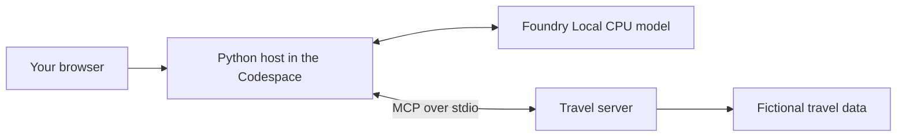

# Build your MCP travel agent in a Codespace

Use your browser to work through the MCP workshop on a Linux computer hosted
by GitHub. You will use the same fictional Indian travel data and Python
programs as the Windows lab, with Linux commands instead of PowerShell.

This guide is the Codespaces entry point. Keep it open beside the editor;
the [image guide](IMAGE.md) is for facilitators who build and distribute the
environment, not a prerequisite for learners.

## Introduction

A **Codespace** is a development computer you access through a browser or VS
Code. A **container image** is the packaged operating environment it starts
from. The workshop image supplies Python and the required libraries.

Foundry Local runs inference on that Codespace's CPU, not on your laptop and
not through a hosted Azure model API. You still need internet to use
Codespaces and complete initial downloads. The Linux SDK also contacts its
catalog to resolve model aliases, even when weights are cached. Keep networking
enabled throughout this lab; this is not the fully offline Windows environment.

## Learning objectives

You will publish Python functions as MCP tools, call them from a client,
and connect a local model that selects a tool. You will also run a browser
interface and distinguish model-generated requests from human approval.

Allow 90 minutes for the lab **after setup finishes**. First-time CLI and
model downloads are separate preparation time; CPU inference can take longer
on a small Codespace.

| Stage | Activity | Minutes |
|---|---|---:|
| 1 | Check your prepared environment | 5 |
| 2 | Inspect MCP messages | 10 |
| 3 | Build a server | 20 |
| 4 | Run the client and agent | 25 |
| 5 | Use the browser app | 10 |
| 6 | Try approval and review controls | 13 |
| 7 | Knowledge check and close | 7 |

## Concept foundation

**Model Context Protocol (MCP)** describes how an application discovers and
uses tools, resources, and prompts. A tool performs an operation, a resource
provides data, and a prompt supplies a reusable message template. None of
these requires a model to exist.

The **host** is the application coordinating everything. In this lab, the
host gives tool descriptions to Foundry Local, executes a structured tool
request through MCP, and formats the result. **Stdio** means the server
exchanges messages through the input and output streams of a local process.



## 1. Open and prepare your Linux environment

Start with a GitHub account that can create Codespaces for this repository.
The workshop configuration and instructions are available on `main`, and the
container image is already published. You do not need the original setup branch
or to build the image yourself.

Use **4 cores and 16 GB RAM** where available. There is no GPU requirement.
GitHub Codespaces compute and storage may be billable; check your spending
limit before creating a machine.

### Create the Codespace in your browser

You do not need GitHub CLI, Docker, or a local terminal to create the
environment. GitHub reads
[.devcontainer/devcontainer.json](../../.devcontainer/devcontainer.json)
automatically and starts the published workshop image.

**Before creating the Codespace**, review the
[Foundry Local CLI license](https://github.com/microsoft/foundry-local/blob/main/LICENSE)
and the model's license. This configuration automatically runs setup with
`--accept-cli-license` in your own Codespace. Only use it if you accept those
terms. The CLI uses Microsoft's license terms; `qwen2.5-1.5b` is listed under
Apache-2.0. Foundry Local may send usage telemetry; see
[Microsoft's privacy statement](https://go.microsoft.com/fwlink/?LinkID=824704).

1. Sign in to GitHub and open
   [GlobalAICommunity/mcp-fl-workshop](https://github.com/GlobalAICommunity/mcp-fl-workshop).
2. Select **main** in the repository's branch dropdown.
3. Click the green **Code** button, then select the **Codespaces** tab.
4. Check the message showing who pays for the Codespace, then click
   **Create codespace on main**. If existing Codespaces are listed, use the
   **+** button to create a new one rather than reopening an old environment.
5. Wait for VS Code to open in your browser and for the post-creation setup
   to finish. Setup installs the pinned Python requirements and Foundry Local
   native runtime, downloads the CLI and CPU model, and checks a structured tool
   call. No separate installation command is needed for a new Codespace.

To choose a machine before creation, select **... > New with options** in
the Codespaces tab. Keep **Branch: main**, select the **MCP workshop - Foundry
Local on Linux** dev container configuration, and choose **4 cores / 16 GB
RAM** or larger. Click **Create codespace**. If the organization does not
offer a suitable machine, ask the facilitator before continuing.

You can return to the environment from
[Your codespaces](https://github.com/codespaces). Creating a new Codespace
does not update an existing one. If you previously used the old configuration
under `docs/codespaces`, create a new Codespace from `main` after saving your
work; the default configuration now lives under `.devcontainer`.

If the image is private, your account and the repository's Codespaces
configuration need package read access. This release is currently private.
See [package access](IMAGE.md#package-access).
Do not paste a token into `devcontainer.json`.

To run the lab locally in VS Code without GHCR access, choose the
**MCP workshop - Foundry Local on Linux (local build)** configuration in
[.devcontainer/local-build/devcontainer.json](../../.devcontainer/local-build/devcontainer.json).
It builds the image from [Dockerfile](Dockerfile) on your machine. The image is
`linux/amd64` only, so Apple Silicon hosts run it under emulation (Rosetta in
Docker Desktop or OrbStack).

### Wait for automatic installation

Creating the Codespace uses only the browser controls above. GitHub runs
`docs/codespaces/setup.sh --accept-cli-license` **inside your Codespace** after
cloning the repository. The container waits for this step before setup is
considered complete. Allow time for the CLI and model downloads.

Follow progress in the Codespaces creation/setup log. An installation failure
stops setup rather than marking an incomplete environment ready. After setup
finishes, open **Terminal > New Terminal**. All lab commands run from the
repository root, normally `/workspaces/mcp-fl-workshop`.

The image uses Python 3.12 and already contains the workshop dependencies.
Startup installs any missing requirements and applies the repository's Linux
pins, so an incomplete Python environment is repaired rather than just reported.
The Codespaces configuration selects its virtual
environment, an isolated set of Python packages, through `PATH` and
`MCP_WORKSHOP_PYTHON`. The setup script also sets these explicitly, so an
inherited shell setting cannot select a different Python. Do not install
`requirements-lock.txt`: that file is the Windows lock and includes Windows-only
packages. You also do not need `workshop.ps1` or `make setup`.

The script downloads CLI preview 0.10.0 **directly from Microsoft**, verifies
its SHA-256 checksum, installs `foundry`, and downloads the SDK's CPU variant
of `qwen2.5-1.5b` (about 1.8 GB). It then checks that the model requests
`get_weather` for Pune. Do not stop the Codespace while setup runs.

CLI 0.10.0 and Python SDK 2.0.1 are separate version lines. The lab uses the
SDK in-process, not a CLI HTTP server. A model downloaded using the CLI alone
is not proof that the SDK's application-specific cache is ready.

Successful setup ends with:

```text
All good - you are ready for the offline workshop.
Codespaces setup complete. Continue with docs/codespaces/README.md.
```

The first message is shared with the Windows readiness checker. It confirms
the cached model is usable; it does not mean GitHub Codespaces itself works
without an internet connection.

### Repair or finish setup in an existing Codespace

An older Codespace does not rerun its creation hook just because files on
`main` changed. Save your work, pull the latest files, and run setup once in
its terminal:

```bash
git pull --ff-only
bash docs/codespaces/setup.sh --accept-cli-license
```

The script creates the workshop virtual environment if missing, installs the
Linux requirements and native SDK runtime, and reuses a matching CLI and cached
model. Rerunning it also retries a failed download. Do not use the Windows
requirements lock or manually install packages into a different Python.

### Check readiness at the start of the lab

```bash
foundry --version
python scripts/verify_setup.py
```

`--skip-model` checks packages and the server only. It is useful for diagnostics,
but is **not** acceptance for the model or browser exercises. Stop and resolve
any full-check failure before continuing.

## 2. See MCP before adding a model

Your environment is ready, so first look at the protocol independently of
inference. Read [Understand MCP](../02-mcp-basics.md) for the concepts, replacing
its Windows commands with the Bash commands here.

The raw helper starts and stops its own server process. You do not need to
leave a separate server terminal running.

```bash
python scripts/raw_jsonrpc.py
python scripts/raw_jsonrpc.py tools/call '{"name":"get_weather","arguments":{"city":"Pune"}}'
```

Find the protocol revision `2026-07-28` and the structured weather fields.
In Bash, the outer single quotes keep the JSON argument together. Use double
quotes inside JSON; do not add PowerShell escaping.

## 3. Build your own travel server

Now turn ordinary Python into an MCP capability. Start small: a dictionary
holds known weather, a function looks it up, and a decorator registers that
function as a tool.

These three examples explain the progression; do not paste them over the
complete server exercise. The full file in the linked lesson adds validation,
a typed result, a resource, and a prompt.

### Start with data

```python
weather = {"Pune": 27}
print(weather["Pune"])
```

### Add a function

```python
weather = {"Pune": 27}

def temperature(city: str) -> int:
    return weather[city]
print(temperature("Pune"))
```

### Register the function

```python
from fastmcp import FastMCP

mcp = FastMCP("Weather example")

@mcp.tool
def temperature(city: str) -> int:
    """Return the example temperature for Pune."""
    return {"Pune": 27}[city]
```

### Complete the exercise

Create the learner file without overwriting an existing solution:

```bash
mkdir -p src/workshop
touch src/workshop/travel_server.py
```

Open [Build a FastMCP server](../03-build-a-server.md) and copy its complete
Python server block into `src/workshop/travel_server.py`. Follow the explanations
there, but use these Linux commands to compile, discover, and call it:

```bash
python -m py_compile src/workshop/travel_server.py
python scripts/raw_jsonrpc.py server/discover '{}' --server src/workshop/travel_server.py
python scripts/raw_jsonrpc.py tools/call '{"name":"get_weather","arguments":{"city":"Pune"}}' --server src/workshop/travel_server.py
```

Now change the input, not the program:

```bash
python scripts/raw_jsonrpc.py tools/call '{"name":"get_weather","arguments":{"city":"Atlantis"}}' --server src/workshop/travel_server.py
```

The tool should report an unknown city rather than crash the server.
The learner server has two tools; the supplied reference server has four.
Later exercises use the reference server, so everyone can continue even if
their learner file is unfinished.

## 4. Connect the client and local model

You have discovered and called a tool. Next, compare a client that calls tools
directly with an agent whose model selects the operation.

Open [Run a client and agent loop](../04-raw-client.md) beside
`src/solution/agent_raw.py`. Its explanations apply unchanged; replace the
PowerShell commands with these:

```bash
python src/solution/mcp_client.py
python src/solution/agent_raw.py "What is the weather in Pune?"
```

The client demonstrates tools, a resource, a prompt, and a recoverable error
without calling a model. The agent should request `get_weather` and return
the typed weather data. CPU inference may take a minute or longer.

The host filters relevant tools, the model chooses one, and MCP executes it.
After a successful call, the host formats the result directly: this workshop
does not require a second model completion to paraphrase it.

## Putting it together in the browser

The browser adds an interface to the same host and model path. It does not
create another AI service. Stop other inference commands before starting it
so they do not compete for CPU and memory.

Start the web app, then use the VS Code **Ports** tab to open port **7932**.
Keep its visibility **Private**, so only authorized users can reach the lab.

```bash
python -m uvicorn --app-dir src/solution web:app --host 0.0.0.0 --port 7932
```

Binding to `0.0.0.0` lets Codespaces forward traffic to the container. It is not
permission to expose an unauthenticated app publicly. Do not make the port
public or forward a Foundry model service.

Ask `What is the weather in Pune?` and compare the tool trace with the terminal
agent. If the browser shows an error, read the server terminal rather than
repeatedly clicking Send. Press `Ctrl+C` to stop the app.

## Practice time: approval and bounded behavior

Tool argument validation is not authorization. The approval demo lets you see
how the host collects a human decision before a fictional operation proceeds.

Run it once accepting, then again declining or cancelling. No real flight is
booked, and there is no need to enter credentials or payment details.

```bash
python src/solution/approval_demo.py
python -m unittest discover -s tests -v
python scripts/validate_content.py
```

Read [Review production controls](../06-where-next.md). Find `MAX_TURNS` in
`src/solution/agent_raw.py` and explain why a host needs a retry limit even
when the model runs locally.

## Solution walkthrough

The reference implementation is available throughout the exercise. Compare
behavior before comparing line count: a typed result and a recoverable
invalid-city error matter more than matching a particular layout.

Trace the boundary between the server, client, and host using this map.
The model never executes Python by itself; the host decides which advertised
tool request to pass to the server.

| File | What to inspect |
|---|---|
| [travel_server.py](../../src/solution/travel_server.py) | Four typed tools, deterministic data, resource and prompt |
| [mcp_client.py](../../src/solution/mcp_client.py) | Discovery, structured results and expected errors |
| [model_config.py](../../src/model_config.py) | CPU selection, cache-only loading and SDK session adapter |
| [agent_raw.py](../../src/solution/agent_raw.py) | Schema translation, execution, bounded retries and result formatting |
| [approval_demo.py](../../src/solution/approval_demo.py) | Human input and the guarded retry |

## Knowledge check

Pause before looking at the answers. These questions check boundaries rather
than command memorization.

Explain each answer using one of the programs you ran; that is a useful way
to confirm that MCP and model inference are separate mechanisms.

1. Does listing MCP tools require Foundry Local to be running?
2. Does a model's valid JSON tool request prove the user approved the action?

**Answers:** No: the standalone MCP client lists tools without a model.
No: a schema validates shape; the host and server must enforce authorization
and any required human approval.

## Chapter recap and saving your work

You have built a server, observed a structured tool call, and connected it to
both a local-model host and a browser. The same Python source works in Linux;
the environment and launch commands are the main differences.

Commit learner changes to your own branch or fork and push them before deleting
the Codespace. A Git commit saves code, not installed packages or model caches.
Use **Stop codespace** when you finish to stop compute billing; storage can
remain billable until deletion.

Stopping and restarting preserves the environment. Rebuilding the container
keeps `/workspaces` but can remove home-directory CLI/model caches and installed
symlinks; rerun the setup command after a rebuild. A new Codespace starts from
the published image and performs its own initial downloads automatically.

### Troubleshooting

| Symptom | Action |
|---|---|
| `denied` when pulling the image | Ask the facilitator to grant package/Codespaces access or make the package public if approved |
| `No module named fastmcp` | Check `which python`; it should select `/opt/workshop-venv/bin/python`, not a manually created `.venv` |
| `No module named foundry_local_sdk` or missing `.venv/bin/python` | Restore the workshop environment using the commands below; the image's SDK may already be installed |
| Windows packages fail to install | Do not use the Windows lock; recreate the Codespace with this configuration |
| `foundry: command not found` | Rerun `setup.sh --accept-cli-license`; the link may have been removed by a rebuild |
| Model is not cached | Run setup while online; a CLI-only download does not establish SDK readiness |
| Model alias is unknown with cached weights | Restore network access so the SDK can resolve its catalog; do not run this image with `--network none` |
| Another `foundry` installation exists | Inspect it before removing or relocating it; setup will not overwrite it |
| Inference is cancelled or the process is killed | Stop other model processes, check `free -h`, and use 4 cores/16 GB or more; rerun the full readiness check |
| Port 7932 does not open | Keep Uvicorn running, check the Ports tab, and keep forwarding Private |

For native model diagnostics, run
`MCP_WORKSHOP_LOG_DIR=./foundry-local-logs python scripts/verify_setup.py`.
Review logs before sharing them; do not publish personal prompts or credentials.

### Repair Python selection in an existing Codespace

An existing terminal may select the wrong Python or lack
`MCP_WORKSHOP_PYTHON`. The checker then looks for a repository-local `.venv`
even though the image's packages are installed in `/opt/workshop-venv`.
There is no need to reinstall the SDK if this import succeeds:

```bash
/opt/workshop-venv/bin/python -c 'import foundry_local_sdk; print(foundry_local_sdk.__file__)'
```

Set the environment in the same terminal, then rerun setup:

```bash
export VIRTUAL_ENV=/opt/workshop-venv
export PATH="$VIRTUAL_ENV/bin:$PATH"
export MCP_WORKSHOP_PYTHON="$VIRTUAL_ENV/bin/python"
bash docs/codespaces/setup.sh --accept-cli-license
```

These exports also fix `python` commands for the rest of that terminal session.
The updated setup script sets them for its own child processes, but cannot
change the terminal that launched it. For future terminals, use the current
`.devcontainer/devcontainer.json` when creating or rebuilding the Codespace.
Save your work before rebuilding and expect to rerun CLI/model setup afterward.
